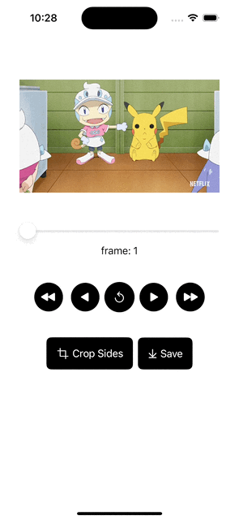

# SwiftUI: Working with Videos using AVFoundation

A project demoing on working with Videos using AVFoundation in SwiftUI. 

This Demo includes the following:

- Retrieve all frames and metadata from a video
- Play the video using the frames
    - Regular frame rate
    - fast forward
    - fast backward
- Modify video frames
- Save modified video (frames) to Photos App
    - Creating Video from image array

------

For more details, please refer to
- [SwiftUI: Working with Video using AVFoundation (Part 1: Read, Display, Modify Frames)](https://medium.com/@itsuki.enjoy/swiftui-working-with-video-using-avfoundation-part-1-read-display-modify-frames-72d6a4d8075e)
- [SwiftUI: Working with Video using AVFoundation (Part 2: Save Images as Video)](https://medium.com/@itsuki.enjoy/swiftui-working-with-video-using-avfoundation-part-2-save-images-as-video-6da8d9677f90)

------

